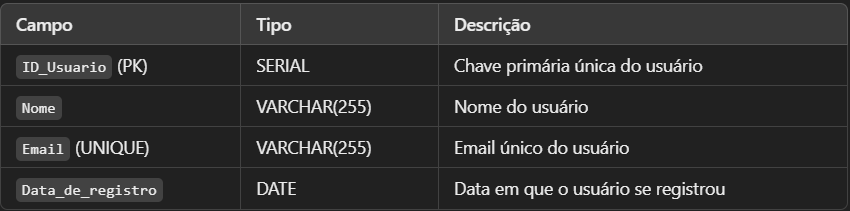

###### Nome: Rafael Pires Rozzatti
###### RA: 11.119.187-0
# Projeto1

## Modelo Entidade Relacionamento:


## Modelo relacional na 3FN (Normalização):

### 1.TAbela: Usuario

A tabela Usuario já está normalizada, cada campo é atômico e não há dependências parciais ou transitivas.

### 2.TAbela: Artista

A tabela Artista também está na 3FN, pois os campos são atômicos e não há dependências transitivas.

### 3.TAbela: Disco

Cada disco tem uma chave primária e todos os campos dependem totalmente dessa chave. Não há dependências transitivas. A chave estrangeira ID_Artista faz referência ao artista.

### 4.TAbela: Musica

A tabela Musica está na 3FN. Cada música depende da chave primária ID_Musica, e a chave estrangeira ID_Disco garante a referência correta ao disco.

### 5.TAbela: Playlist

Cada playlist pertence a um usuário, e todos os atributos dependem diretamente da chave primária ID_Playlist. A chave estrangeira ID_Usuario referencia corretamente o criador da playlist.

### 6.TAbela: Playlist_Musica

Esta tabela resolve o relacionamento muitos-para-muitos entre playlists e músicas. Ambas as chaves estrangeiras (ID_Playlist e ID_Musica) formam a chave primária composta.

### 7.TAbela: Usuario

Esta tabela resolve o relacionamento muitos-para-muitos entre artistas e músicas. Novamente, as chaves estrangeiras formam uma chave primária composta.

## Queries para a criação das tabelas necessárias:

```
    CREATE TABLE Usuarios (
    id SERIAL PRIMARY KEY,
    nome VARCHAR(255) NOT NULL,
    email VARCHAR(255) UNIQUE NOT NULL,
    data_registro DATE NOT NULL
);

CREATE TABLE Artistas (
    id SERIAL PRIMARY KEY,
    nome VARCHAR(255) NOT NULL,
    data_nascimento DATE
);

CREATE TABLE Discos (
    id SERIAL PRIMARY KEY,
    titulo VARCHAR(255) NOT NULL,
    data_lancamento DATE,
    artista_id INT NOT NULL,
    FOREIGN KEY (artista_id) REFERENCES Artistas(id)
);

CREATE TABLE Musicas (
    id SERIAL PRIMARY KEY,
    titulo VARCHAR(255) NOT NULL,
    duracao INT NOT NULL,
    disco_id INT NOT NULL,
    FOREIGN KEY (disco_id) REFERENCES Discos(id)
);

CREATE TABLE Playlists (
    id SERIAL PRIMARY KEY,
    titulo VARCHAR(255) NOT NULL,
    usuario_id INT NOT NULL,
    FOREIGN KEY (usuario_id) REFERENCES Usuarios(id)
);

CREATE TABLE Playlist_Musicas (
    playlist_id INT NOT NULL,
    musica_id INT NOT NULL,
    PRIMARY KEY (playlist_id, musica_id),
    FOREIGN KEY (playlist_id) REFERENCES Playlists(id),
    FOREIGN KEY (musica_id) REFERENCES Musicas(id)
);

CREATE TABLE Musica_Artistas (
    musica_id INT NOT NULL,
    artista_id INT NOT NULL,
    PRIMARY KEY (musica_id, artista_id),
    FOREIGN KEY (musica_id) REFERENCES Musicas(id),
    FOREIGN KEY (artista_id) REFERENCES Artistas(id)
);
```
### Instruções:
#### 1. **Rodar o Código SQL:**
   - Copie e cole o código SQL no console ou no editor de SQL.
   - O código cria as seguintes tabelas:
     - **Usuarios**: Armazena dados dos usuários.
     - **Artistas**: Armazena informações dos artistas.
     - **Discos**: Guarda os discos lançados pelos artistas.
     - **Musicas**: Armazena as músicas e suas informações.
     - **Playlists**: Contém as playlists criadas pelos usuários.
     - **Playlist_Musicas**: Liga músicas às playlists (relação N:N).
     - **Musica_Artistas**: Liga músicas aos artistas (relação N:N).

#### 2. **Executar o Código SQL:**
   - Cole o código diretamente e aperte **Enter** ou **Executar**

#### 3. **Verificar se as Tabelas Foram Criadas**:
   - Após a execução bem-sucedida, verifique se as tabelas foram criadas corretamente.

#### 4. **Inserir Dados nas Tabelas**:
   - Depois que as tabelas são criadas, insira dados como este exemplo:
     ```sql
     INSERT INTO Usuarios (nome, email, data_registro) VALUES ('João Silva', 'joao@exemplo.com', '2024-01-01');
     ```

Agora o banco de dados está pronto para armazenar informações do seu sistema de streaming de música!


## Código desenvolvido para gerar dados aleatórios:
```
from faker import Faker
import random
import mysql.connector

fake = Faker()

db_config = {
    'host': 'localhost',
    'user': 'usuario',
    'password': 'senha',
    'database': 'streaming_musica'
}

db = mysql.connector.connect(**db_config)
cursor = db.cursor()

def gerar_dados():
    for _ in range(10):
        nome = fake.name()
        data_nascimento = fake.date_of_birth()
        cursor.execute("INSERT INTO Artistas (nome, data_nascimento) VALUES (%s, %s)", (nome, data_nascimento))

    for _ in range(10):
        nome = fake.name()
        email = fake.email()
        data_registro = fake.date_this_year()
        cursor.execute("INSERT INTO Usuarios (nome, email, data_registro) VALUES (%s, %s, %s)", (nome, email, data_registro))

    for _ in range(10):
        titulo_disco = fake.sentence(nb_words=3)
        data_lancamento = fake.date()
        artista_id = random.randint(1, 10)
        cursor.execute("INSERT INTO Discos (titulo, data_lancamento, artista_id) VALUES (%s, %s, %s)", (titulo_disco, data_lancamento, artista_id))
        disco_id = cursor.lastrowid

        for _ in range(random.randint(5, 10)):
            titulo_musica = fake.sentence(nb_words=2)
            duracao = random.randint(120, 360)
            cursor.execute("INSERT INTO Musicas (titulo, duracao, disco_id) VALUES (%s, %s, %s)", (titulo_musica, duracao, disco_id))

    for _ in range(10):
        titulo_playlist = fake.sentence(nb_words=2)
        usuario_id = random.randint(1, 10)
        cursor.execute("INSERT INTO Playlists (titulo, usuario_id) VALUES (%s, %s)", (titulo_playlist, usuario_id))
        playlist_id = cursor.lastrowid

        for _ in range(random.randint(5, 10)):
            musica_id = random.randint(1, 50)  # Assume que existem até 50 músicas inseridas
            cursor.execute("INSERT INTO Playlist_Musicas (playlist_id, musica_id) VALUES (%s, %s)", (playlist_id, musica_id))

    db.commit()

if __name__ == "__main__":
    try:
        gerar_dados()
        print("Dados inseridos com sucesso!")
    except mysql.connector.Error as err:
        print(f"Erro: {err}")
        db.rollback()
    finally:
        cursor.close()
        db.close()
```
### Instruções:
#### 1. **Pré-requisitos:**
   - **Python 3** instalado.
   - Biblioteca **Faker** instalada:
     - Execute no terminal:
       ```python
       pip install faker
       ```
   - Biblioteca **mysql-connector-python** instalada:
     - Execute no terminal:
       ```python
       pip install mysql-connector-python
       ```
   - Banco de dados MySQL criado e configurado.

#### 2. **Configurar o Banco de Dados:**
   - Crie um banco de dados MySQL chamado `streaming_musica`.
   - Certifique-se de que as tabelas estão criadas conforme o código SQL anterior.

#### 3. **Configurar Conexão com o Banco de Dados:**
   - No código, altere as configurações de conexão com o banco:
     ```python
     db_config = {
         'host': 'localhost',
         'user': 'usuario',   # Substitua por seu usuário do MySQL
         'password': 'senha', # Substitua pela sua senha
         'database': 'streaming_musica'
     }
     ```
   - Ajuste `user` e `password` conforme as credenciais do seu banco de dados.

#### 4. **Gerar e Inserir Dados Aleatórios:**
   - O código gera dados aleatórios para as seguintes tabelas:
     - **Artistas**: 10 artistas com nomes e datas de nascimento.
     - **Usuarios**: 10 usuários com nomes, e-mails e datas de registro.
     - **Discos**: 10 discos, cada um associado a um artista.
     - **Musicas**: Cada disco tem entre 5 e 10 músicas.
     - **Playlists**: 10 playlists, cada uma associada a um usuário.
     - **Playlist_Musicas**: Cada playlist tem entre 5 e 10 músicas aleatórias.

#### 5. **Rodar o Código Python:**
   - Salve o código Python em um arquivo (`inserir_dados.py`, por exemplo).
   - Execute o arquivo no terminal:
     ```python
     python inserir_dados.py
     ```
   - O código conectará ao banco de dados e gerará os dados automaticamente.

#### 6. **Verificar Inserções no Banco de Dados:**
   - Após a execução, os dados aleatórios serão inseridos nas tabelas.
   - Use uma ferramenta como **MySQL Workbench** ou o terminal **MySQL** para verificar os dados:
     ```sql
     SELECT * FROM Artistas;
     SELECT * FROM Usuarios;
     ```

## Queries em SQL que resolvem os 20 itens da atividade de álgebra relacional:
### 1-Liste o título de todas as músicas e suas durações.
```sql
SELECT titulo, duracao FROM Musicas;
```
### 2-Encontre o nome de todos os artistas que têm mais de 5 músicas em seu repertório.
```sql
SELECT a.nome
FROM Artistas a
JOIN Musica_Artistas ma ON a.id = ma.artista_id
GROUP BY a.id, a.nome
HAVING COUNT(ma.musica_id) > 5;
```
### 3-Quais são os títulos dos discos lançados após 2020?
```sql
SELECT titulo FROM Discos WHERE data_lancamento > '2020-12-31';
```
### 4-Liste os títulos das músicas e os nomes dos artistas que as interpretam, ordenados pelo título da música.
```sql
SELECT m.titulo, a.nome
FROM Musicas m
JOIN Musica_Artistas ma ON m.id = ma.musica_id
JOIN Artistas a ON a.id = ma.artista_id
ORDER BY m.titulo;
```
### 5-Encontre os títulos das playlists que contêm a música com o título 'Imagine'.
```sql
SELECT p.titulo
FROM Playlists p
JOIN Playlist_Musicas pm ON p.id = pm.playlist_id
JOIN Musicas m ON m.id = pm.musica_id
WHERE m.titulo = 'Imagine';
```
### 6-Liste os usuários que criaram playlists que contêm músicas do disco 'Abbey Road'.
```sql
SELECT u.nome
FROM Usuarios u
JOIN Playlists p ON u.id = p.usuario_id
JOIN Playlist_Musicas pm ON p.id = pm.playlist_id
JOIN Musicas m ON pm.musica_id = m.id
JOIN Discos d ON m.disco_id = d.id
WHERE d.titulo = 'Abbey Road';
```
### 7-Qual é a duração média das músicas de um artista específico?
```sql
SELECT AVG(m.duracao) AS duracao_media
FROM Musicas m
JOIN Musica_Artistas ma ON m.id = ma.musica_id
JOIN Artistas a ON a.id = ma.artista_id
WHERE a.nome = 'Nome do Artista';
```
### 8-Encontre todos os artistas que não têm músicas.
```sql
SELECT a.nome
FROM Artistas a
LEFT JOIN Musica_Artistas ma ON a.id = ma.artista_id
WHERE ma.musica_id IS NULL;
```
### 9-Liste todos os discos que contêm mais de 10 músicas.
```sql
SELECT d.titulo
FROM Discos d
JOIN Musicas m ON d.id = m.disco_id
GROUP BY d.id, d.titulo
HAVING COUNT(m.id) > 10;
```
### 10-Quais são os nomes dos artistas que têm discos lançados antes de 2010 e que têm músicas na playlist 'Top 50'?
```sql
SELECT DISTINCT a.nome
FROM Artistas a
JOIN Discos d ON a.id = d.artista_id
JOIN Musicas m ON d.id = m.disco_id
JOIN Playlist_Musicas pm ON m.id = pm.musica_id
JOIN Playlists p ON pm.playlist_id = p.id
WHERE d.data_lancamento < '2010-01-01' AND p.titulo = 'Top 50';
```
### 11-Quais músicas são interpretadas por mais de um artista?
```sql
SELECT m.titulo
FROM Musicas m
JOIN Musica_Artistas ma ON m.id = ma.musica_id
GROUP BY m.id, m.titulo
HAVING COUNT(ma.artista_id) > 1;
```
### 12-Liste os títulos das músicas que aparecem em mais de uma playlist.
```sql
SELECT m.titulo
FROM Musicas m
JOIN Playlist_Musicas pm ON m.id = pm.musica_id
GROUP BY m.id, m.titulo
HAVING COUNT(pm.playlist_id) > 1;
```
### 13-Encontre os nomes dos usuários que têm playlists que incluem a música 'Bohemian Rhapsody'.
```sql
SELECT u.nome
FROM Usuarios u
JOIN Playlists p ON u.id = p.usuario_id
JOIN Playlist_Musicas pm ON p.id = pm.playlist_id
JOIN Musicas m ON pm.musica_id = m.id
WHERE m.titulo = 'Bohemian Rhapsody';
```
### 14-Qual é o título da música mais longa do disco 'Dark Side of the Moon'?
```sql
SELECT m.titulo
FROM Musicas m
JOIN Discos d ON m.disco_id = d.id
WHERE d.titulo = 'Dark Side of the Moon'
ORDER BY m.duracao DESC
LIMIT 1;
```
### 15-Liste todos os discos lançados por um artista específico em um determinado ano.
```sql
SELECT d.titulo
FROM Discos d
JOIN Artistas a ON d.artista_id = a.id
WHERE a.nome = 'Nome do Artista'
AND YEAR(d.data_lancamento) = 2023;
```
### 16-Quais são os nomes dos artistas que têm músicas em playlists criadas por um usuário específico.
```sql
SELECT DISTINCT a.nome
FROM Artistas a
JOIN Musica_Artistas ma ON a.id = ma.artista_id
JOIN Musicas m ON ma.musica_id = m.id
JOIN Playlist_Musicas pm ON m.id = pm.musica_id
JOIN Playlists p ON pm.playlist_id = p.id
JOIN Usuarios u ON p.usuario_id = u.id
WHERE u.nome = 'Nome do Usuário';
```
### 17-Encontre a lista de músicas que não estão em nenhuma playlist.
```sql
SELECT m.titulo
FROM Musicas m
LEFT JOIN Playlist_Musicas pm ON m.id = pm.musica_id
WHERE pm.playlist_id IS NULL;
```
### 18-Liste os títulos das músicas e os nomes dos artistas que têm mais de 3 músicas em uma mesma playlist.
```sql
SELECT m.titulo, a.nome
FROM Musicas m
JOIN Musica_Artistas ma ON m.id = ma.musica_id
JOIN Artistas a ON ma.artista_id = a.id
JOIN Playlist_Musicas pm ON m.id = pm.musica_id
GROUP BY pm.playlist_id, a.nome, m.titulo
HAVING COUNT(m.id) > 3;
```
### 19-Quais são os discos que contêm músicas de artistas que têm pelo menos 2 discos lançados?
```sql
SELECT DISTINCT d.titulo
FROM Discos d
JOIN Musicas m ON d.id = m.disco_id
JOIN Musica_Artistas ma ON m.id = ma.musica_id
JOIN Artistas a ON ma.artista_id = a.id
WHERE (SELECT COUNT(*) FROM Discos WHERE artista_id = a.id) >= 2;
```
### 20-Liste todos os usuários e suas playlists, mas apenas para playlists que contêm pelo menos 5 músicas.
```sql
SELECT u.nome AS usuario, p.titulo AS playlist
FROM Usuarios u
JOIN Playlists p ON u.id = p.usuario_id
JOIN Playlist_Musicas pm ON p.id = pm.playlist_id
GROUP BY p.id, u.nome, p.titulo
HAVING COUNT(pm.musica_id) >= 5;;
```
### Instruções:
   - Execute cada query uma de cada vez.
   - Substitua os valores de exemplo (como `'Nome do Artista'` e `'Bohemian Rhapsody'`) com os valores reais que deseja consultar.
   - Verifique os resultados diretamente no cliente MySQL.